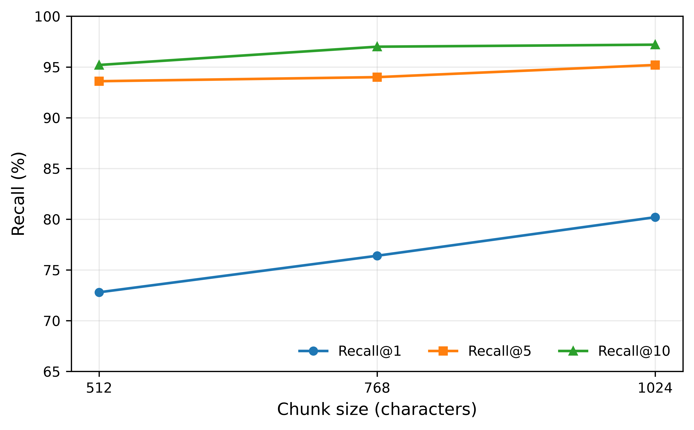
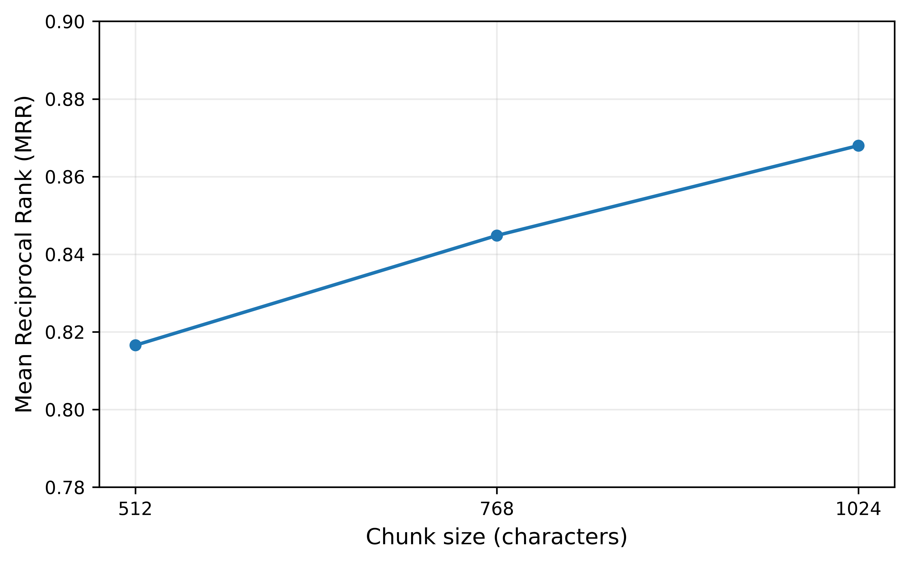
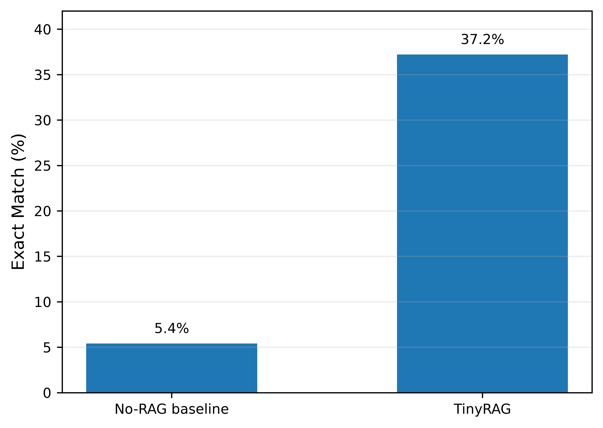
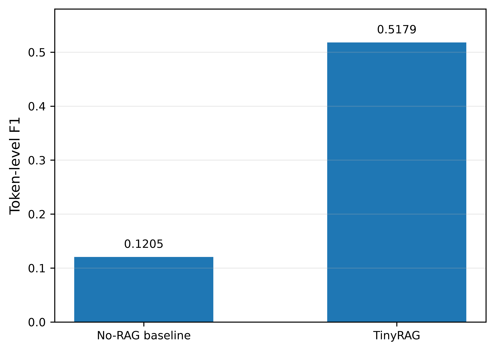
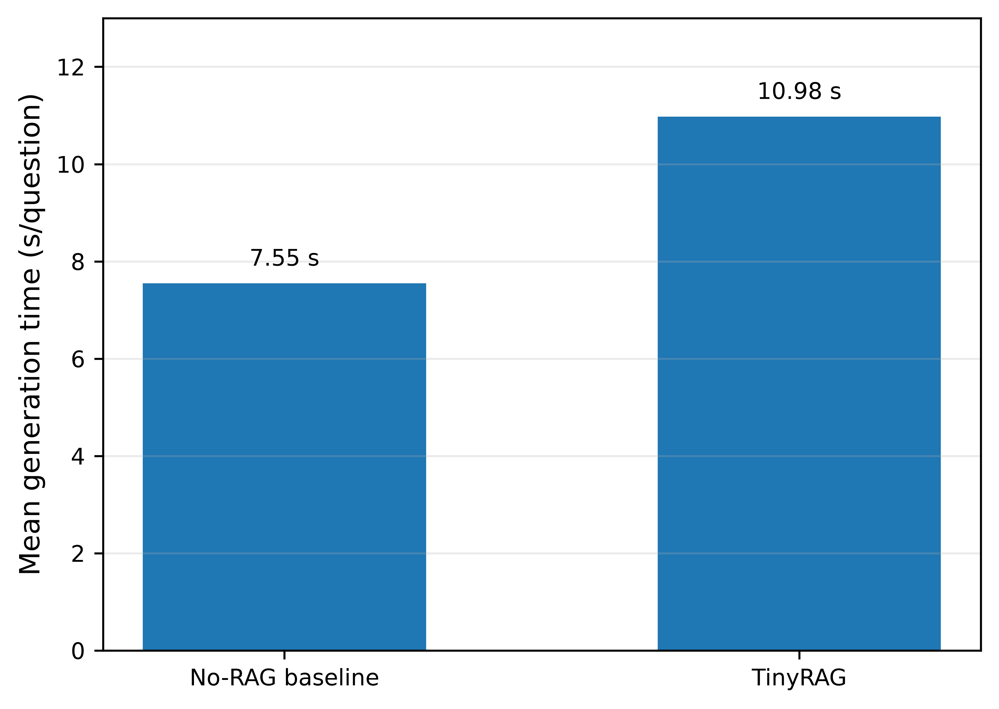

<div align="center">

# ⚡ TinyRAG: CPU-Only Retrieval-Augmented Generation on a 16 GB Laptop

[](paper/experiment_summary.md)
[](https://www.python.org/)
[](https://pytorch.org/)
[](https://huggingface.co/)
[](LICENSE)

<p align="center">
  <b>A lightweight, fully reproducible RAG framework designed for consumer laptop hardware without dedicated GPUs.</b><br/>
  <i>Achieving a <b>+31.8%</b> Exact Match gain and <b>+0.3974</b> Token F1 improvement over a parametric baseline within a strict 16 GB memory footprint.</i>
</p>

<p align="center">
  <a href="#-system-architecture">Architecture</a> •
  <a href="#-key-experimental-results">Results</a> •
  <a href="#-experimental-figures">Figures</a> •
  <a href="#-hardware--system-profile">Hardware Profile</a> •
  <a href="#-reproduction-pipeline">Reproduction Guide</a> •
  <a href="#-citation">Citation</a>
</p>

---

### 🌟 Key Performance Highlights

| 🎯 Exact Match | 📊 Token F1 | 🔍 Recall@1 | ⚡ End-to-End Latency | 💻 Hardware Required |
| :---: | :---: | :---: | :---: | :---: |
| **37.2%** vs 5.4%<br/>*(+31.8% absolute)* | **0.5179** vs 0.1205<br/>*(+0.3974 gain)* | **80.2%** (Top-1)<br/>*97.2% (Top-10)* | **10.98 s** / question<br/>*Zero OOM / 0 Errors* | **0 GPUs**<br/>*Standard 16 GB Laptop* |

---

</div>

## 📌 Overview

Large-scale Retrieval-Augmented Generation (RAG) typically relies on high-memory GPUs or expensive cloud infrastructure. **TinyRAG** addresses the resource barrier by demonstrating that high-precision, low-latency question answering can be executed purely on consumer-grade CPU hardware.

Evaluated on **500 SQuAD validation questions** across **447 unique documents**, TinyRAG pairs an ultra-compact bi-encoder (`sentence-transformers/all-MiniLM-L6-v2`, 384-dim) with an efficient 1.7B instruction-tuned generative model (`HuggingFaceTB/SmolLM2-1.7B-Instruct`).

---

## 🏛️ System Architecture

<div align="center">
  
  <p><i>Figure 1: Modular TinyRAG architecture spanning offline indexing, real-time dense retrieval, CPU-based prompt synthesis, and paired statistical validation.</i></p>
</div>

The TinyRAG pipeline consists of four modular stages:

1. **Knowledge Preparation**: Source documents are preprocessed and segmented using sliding-window chunking (512, 768, and 1024 characters with 128-char overlap).
2. **Dense Retrieval**: An `all-MiniLM-L6-v2` bi-encoder produces 384-dimensional dense vectors. Efficient cosine similarity search ranks candidates in sub-millisecond time.
3. **CPU Generation**: The top-ranked context chunk is injected into a strict factual prompt fed to `SmolLM2-1.7B-Instruct` using 4 PyTorch intra-op threads with greedy decoding (max 32 new tokens).
4. **Evaluation & Verification**: Paired Exact Match (EM) and Token F1 scores are benchmarked against an identical No-RAG baseline, supported by exact McNemar's tests and 10,000 paired-bootstrap iterations.

---

## 📊 Key Experimental Results

### 1. Retrieval Performance Across Chunk Sizes

Evaluating candidate retrieval over 447 source documents (500 validation queries):

| Chunk Size | Total Chunks | Recall@1 (%) | Recall@5 (%) | Recall@10 (%) | MRR | Mean Latency | P95 Latency |
| :--- | :---: | :---: | :---: | :---: | :---: | :---: | :---: |
| **512 chars** | 1,005 | 72.8% | 93.6% | 95.2% | 0.8166 | 0.206 ms | 0.269 ms |
| **768 chars** | 651 | 76.4% | 94.0% | 97.0% | 0.8448 | 0.158 ms | 0.209 ms |
| **1024 chars** *(Best)* | **529** | **80.2%** | **95.2%** | **97.2%** | **0.8680** | **0.151 ms** | **0.197 ms** |

> **Finding**: The 1024-character configuration yielded superior top-1 precision (80.2%) and mean reciprocal rank (0.868) while keeping corpus size compact (529 chunks).

---

### 2. End-to-End QA: TinyRAG vs. No-RAG Baseline

Full 500-question end-to-end evaluation using `SmolLM2-1.7B-Instruct` on CPU:

| Configuration | Context Injected | Exact Match (EM) | Token F1 | Mean Generation Time | Median Generation Time |
| :--- | :--- | :---: | :---: | :---: | :---: |
| **No-RAG Baseline** | None (Parametric only) | 5.4% | 0.1205 | 7.55 s / q | 6.45 s / q |
| **TinyRAG** | 1024-char Top-1 Chunk | **37.2%** | **0.5179** | 10.98 s / q | 10.37 s / q |
| **Improvement** | — | **+31.8%** | **+0.3974** | +3.43 s | +3.92 s |

---

### 3. Statistical Significance & Reliability

- **Paired Sample**: 500 identical questions evaluated across both systems.
- **McNemar's Exact Test**: $p < 0.0001$ (TinyRAG correct & baseline wrong: 163; reverse: 4).
- **Exact Match 95% Bootstrap CI**: `[+27.60%, +36.00%]` (10,000 paired resamples, seed 42).
- **Token F1 95% Bootstrap CI**: `[+0.3595, +0.4362]` (strictly excludes 0).
- **System Stability**: 0 errors, 0 memory faults, and zero out-of-memory crashes across all 500 runs.

---

## 📈 Experimental Figures

All figures are generated in publication-grade 600 DPI vector and raster formats:

<div align="center">

| Retrieval Recall vs. Chunk Size | Mean Reciprocal Rank (MRR) |
| :---: | :---: |
|  |  |
| **Figure 2**: Recall@1, 5, 10 across chunk lengths | **Figure 3**: MRR progression across chunk configurations |

| End-to-End Exact Match | End-to-End Token F1 | Generation Latency Comparison |
| :---: | :---: | :---: |
|  |  |  |
| **Figure 4**: Exact Match (+31.8%) | **Figure 5**: Token F1 (+0.3974) | **Figure 6**: Latency comparison on CPU |

</div>

---

## ⚙️ Hardware & System Profile

All experiments were executed on an off-the-shelf consumer laptop:

```yaml
Hardware Profile:
  Processor: Intel64 Family 6 Model 166 (4 physical cores, 8 logical threads)
  Total RAM: 15.79 GB
  Device: CPU-only (No discrete GPU acceleration)
  PyTorch Threads: 4 intra-op threads / 4 inter-op threads
  Operating System: Windows 11 (AMD64)
  Python Version: 3.11.16
  PyTorch Version: 2.14.0+cpu
```

> The complete system snapshot is preserved in [`results/system_profile.json`](results/system_profile.json) and [`results/system_profile.csv`](results/system_profile.csv).

---

## 📂 Repository Structure

```text
TinyRAG/
├── .gitignore                    # Strict exclusions for caches, weights, and logs
├── README.md                     # Project documentation & reproduction instructions
├── requirements.txt              # Pinned core dependencies
├── figures/
│   └── paper_600dpi/             # 600 DPI publication figures and architecture diagram
│       ├── TinyRAG_Architecture.png
│       ├── Figure_1_Retrieval_Recall.pdf / .png
│       ├── Figure_2_MRR.pdf / .png
│       ├── Figure_3_End_to_End_EM.pdf / .png
│       ├── Figure_4_End_to_End_F1.pdf / .png
│       └── Figure_5_Generation_Latency.pdf / .png
├── paper/
│   ├── experiment_summary.md     # Full metric breakdown and parameter configurations
│   └── tables/                   # Paper-ready tables in Markdown and CSV format
│       ├── paper_tables.md
│       ├── table1_retrieval_results.csv
│       ├── table2_end_to_end_results.csv
│       └── table3_statistical_comparison.csv
├── results/
│   ├── final/                    # Aggregated statistical summaries
│   │   ├── end_to_end_statistical_summary.csv
│   │   └── final_results_table.csv
│   ├── comparison/
│   │   └── rag_vs_baseline_summary.csv
│   ├── retrieval/
│   │   └── retrieval_summary.csv
│   ├── system_profile.csv        # Hardware metrics in flat CSV format
│   └── system_profile.json       # Detailed JSON system profile
└── scripts/                      # Sequential, reproducible execution pipeline
    ├── config.py                 # Fully portable directory and environment paths
    ├── logger.py                 # Centralized timestamped logging
    ├── checkpoint.py             # Atomic checkpointing for long runs
    ├── 01_environment.py         # Hardware and runtime environment validation
    ├── 04_prepare_dataset.py     # SQuAD download and seed-42 validation split sampling
    ├── 05_verify_dataset.py      # Dataset integrity validation
    ├── 06_create_chunks.py       # Sliding window text chunking
    ├── 08_create_gold_mapping.py  # Chunk-to-gold document mapping
    ├── 09_embed_corpus.py        # Dense embedding generation via MiniLM
    ├── 10_retrieval_eval.py      # Retrieval evaluation (Recall@K, MRR, latency)
    ├── 18_rag_eval.py            # 500-question TinyRAG generation
    ├── 19_baseline_eval.py       # 500-question No-RAG baseline generation
    ├── 20_compare_rag_baseline.py# Paired McNemar and bootstrap analysis
    ├── 21_make_results_table.py  # Result table generation
    ├── 22_make_figures.py        # 600 DPI publication figure generation
    ├── 23_make_paper_tables.py   # Paper table generator
    └── 24_system_profile.py      # Automated hardware profiler
```

---

## 🚀 Reproduction Pipeline

Reproduce all experimental results, statistical tests, and publication figures from scratch in four simple steps:

### 1. Environment Setup

```bash
git clone https://github.com/Hasnain006-nain/TinyRAG.git
cd TinyRAG
pip install -r requirements.txt
```

### 2. Dataset & Chunk Preparation

```bash
# Verify environment configuration
python scripts/01_environment.py

# Download SQuAD validation split and sample 500 questions (seed 42)
python scripts/04_prepare_dataset.py
python scripts/05_verify_dataset.py

# Partition corpus into 512, 768, and 1024-character sliding windows
python scripts/06_create_chunks.py
python scripts/08_create_gold_mapping.py
```

### 3. Embedding & Retrieval Evaluation

```bash
# Compute dense embeddings with sentence-transformers/all-MiniLM-L6-v2
python scripts/09_embed_corpus.py

# Benchmark retrieval recall and MRR across chunk configurations
python scripts/10_retrieval_eval.py
```

### 4. End-to-End Generation & Statistical Analysis

```bash
# Execute full 500-question TinyRAG generation (Top-1 1024-char chunk)
python scripts/18_rag_eval.py

# Execute full 500-question parametric No-RAG baseline
python scripts/19_baseline_eval.py

# Run paired McNemar test and 10,000 bootstrap iterations
python scripts/20_compare_rag_baseline.py

# Compile final result tables, high-resolution figures, and system profile
python scripts/21_make_results_table.py
python scripts/22_make_figures.py
python scripts/23_make_paper_tables.py
python scripts/24_system_profile.py
```

> **Artifact Policy**: Model caches (`hf_cache/`), precalculated embedding matrices (`embeddings/*.npy`), raw uncompressed TIFFs, and intermediate run logs are excluded by design. Running the scripts above automatically recreates all artifacts deterministically from scratch.

---

## 📖 Citation

If you use TinyRAG in your research, please cite:

```bibtex
@article{tinyrag2027,
  title   = {TinyRAG: CPU-Only Retrieval-Augmented Generation on a 16 GB Laptop},
  author  = {AAAI Student Abstract Authors},
  year    = {2027},
  note    = {AAAI-27 Student Abstract}
}
```

---

<div align="center">
  <sub>Developed for the AAAI-27 Student Abstract track. Released under the <a href="LICENSE">MIT License</a>.</sub>
</div>
