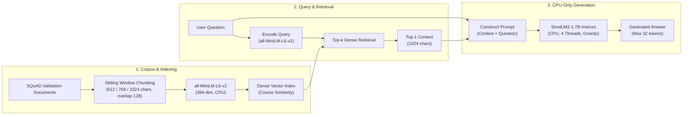

# TinyRAG: CPU-Only Retrieval-Augmented Generation on a 16 GB Laptop

Official reproducibility repository for the AAAI student abstract project: **"TinyRAG: CPU-Only Retrieval-Augmented Generation on a 16 GB Laptop"**.

---

## Overview

Retrieval-Augmented Generation (RAG) is commonly deployed on high-end GPUs or dedicated cloud servers. **TinyRAG** explores the feasibility, performance, and efficiency of executing an entire end-to-end RAG pipeline purely on consumer-grade laptop hardware without GPU acceleration.

Using a lightweight dual-model architecture, TinyRAG pairs an efficient embedding model with a compact instruction-tuned language model to perform question answering over the Stanford Question Answering Dataset (SQuAD) under strict resource constraints.

---

## System Architecture




---

## Key Experimental Results

TinyRAG was evaluated on **500 SQuAD validation questions** (random seed `42`) against a parametric-only **No-RAG baseline** running on the exact same laptop hardware.

### 1. Retrieval Performance Across Chunk Sizes

Dense retrieval using `sentence-transformers/all-MiniLM-L6-v2` across 447 unique documents:

| Chunk Size | Corpus Chunks | Recall@1 (%) | Recall@5 (%) | Recall@10 (%) | MRR | Mean Latency (ms) | P95 Latency (ms) |
|:---:|:---:|:---:|:---:|:---:|:---:|:---:|:---:|
| 512 chars | 1,005 | 72.8% | 93.6% | 95.2% | 0.8166 | 0.206 ms | 0.269 ms |
| 768 chars | 651 | 76.4% | 94.0% | 97.0% | 0.8448 | 0.158 ms | 0.209 ms |
| **1024 chars** | **529** | **80.2%** | **95.2%** | **97.2%** | **0.8680** | **0.151 ms** | **0.197 ms** |

*Best setting: 1024-character chunks achieves 80.2% Recall@1 and 0.868 MRR.*

### 2. End-to-End QA: TinyRAG vs. No-RAG Baseline

End-to-end evaluation using `HuggingFaceTB/SmolLM2-1.7B-Instruct` (Top-1 context from 1024-char chunks vs. No Context):

| System | Context | Exact Match (EM) | Token F1 | Mean Latency (s/q) | Median Latency (s/q) |
|:---|:---|:---:|:---:|:---:|:---:|
| **No-RAG Baseline** | None | 5.4% | 0.1205 | 7.55 s | 6.45 s |
| **TinyRAG** | 1024-char Top-1 | **37.2%** | **0.5179** | 10.98 s | 10.37 s |
| **Absolute Gain** | — | **+31.8%** | **+0.3974** | +3.43 s | +3.92 s |

### 3. Statistical Significance Analysis

- **Paired Questions**: 500 identical evaluation questions
- **McNemar's Test**: $p < 0.0001$ (TinyRAG correct & baseline wrong: 163; Baseline correct & TinyRAG wrong: 4)
- **Exact Match 95% Bootstrap CI for Difference**: `[+27.60%, +36.00%]` (10,000 resamples, seed 42)
- **Token F1 95% Bootstrap CI for Difference**: `[+0.3595, +0.4362]` (95% CI strictly excludes zero)
- **Generation Reliability**: Zero generation errors across all 500 questions

---

## Hardware & System Profile

All experiments were executed locally on a single consumer laptop without dedicated GPU acceleration:

- **Operating System**: Windows 11 (AMD64)
- **CPU**: Quad-core Intel Processor (4 physical cores, 8 logical threads)
- **System Memory**: 15.79 GB total RAM
- **PyTorch Device**: CPU-only (`torch.device("cpu")`)
- **PyTorch Threads**: 4 intra-op threads, 4 inter-op threads
- **Python Version**: 3.11

Detailed hardware and software profiling snapshots are preserved in [`results/system_profile.json`](results/system_profile.json) and [`results/system_profile.csv`](results/system_profile.csv).

---

## Models & Dataset

- **Embedding Model**: [`sentence-transformers/all-MiniLM-L6-v2`](https://huggingface.co/sentence-transformers/all-MiniLM-L6-v2)
  - Dimension: 384
  - Metric: Cosine similarity
- **Generation Model**: [`HuggingFaceTB/SmolLM2-1.7B-Instruct`](https://huggingface.co/HuggingFaceTB/SmolLM2-1.7B-Instruct)
  - Parameter Count: 1.7 Billion
  - Decoding: Greedy search (temperature = 0, sampling disabled)
  - Max New Tokens: 32
- **Evaluation Dataset**: Stanford Question Answering Dataset ([SQuAD v1.1](https://huggingface.co/datasets/rajpurkar/squad))
  - Subset: 500 validation questions sampled with random seed `42`
  - Documents: 447 unique context passages

---

## Repository Structure

```text
TinyRAG/
├── .gitignore               # Strict exclusion rules for caches, weights, and logs
├── README.md                # Project documentation and reproduction guide
├── requirements.txt         # Core dependencies
├── figures/
│   └── paper_600dpi/        # Publication-ready figures (PNG & 600 DPI PDF)
│       ├── Figure_1_Retrieval_Recall.pdf / .png
│       ├── Figure_2_MRR.pdf / .png
│       ├── Figure_3_End_to_End_EM.pdf / .png
│       ├── Figure_4_End_to_End_F1.pdf / .png
│       ├── Figure_5_Generation_Latency.pdf / .png
│       └── TinyRAG_Architecture.png
├── paper/
│   ├── experiment_summary.md # Comprehensive experimental parameters and metrics
│   └── tables/              # Markdown and CSV tables reported in the paper
│       ├── paper_tables.md
│       ├── table1_retrieval_results.csv
│       ├── table2_end_to_end_results.csv
│       └── table3_statistical_comparison.csv
├── results/
│   ├── final/               # Final aggregated statistical summaries
│   │   ├── end_to_end_statistical_summary.csv
│   │   └── final_results_table.csv
│   ├── comparison/
│   │   └── rag_vs_baseline_summary.csv
│   ├── retrieval/
│   │   └── retrieval_summary.csv
│   ├── system_profile.csv   # Flat CSV system profiling metrics
│   └── system_profile.json  # Full JSON hardware snapshot
└── scripts/                 # Numbered reproducible execution pipeline
    ├── config.py            # Portable path configuration
    ├── logger.py            # Unified logging setup
    ├── checkpoint.py        # Safe execution checkpointing
    ├── 01_environment.py    # Environment check
    ├── 04_prepare_dataset.py# SQuAD download and sampling
    ├── 05_verify_dataset.py # Verification of evaluation questions
    ├── 06_create_chunks.py  # Sliding window chunk creation
    ├── 08_create_gold_mapping.py # Gold label mapping to chunks
    ├── 09_embed_corpus.py   # Corpus embedding generation
    ├── 10_retrieval_eval.py # Retrieval evaluation across chunk sizes
    ├── 18_rag_eval.py       # 500-question TinyRAG evaluation
    ├── 19_baseline_eval.py  # 500-question No-RAG baseline evaluation
    ├── 20_compare_rag_baseline.py # McNemar & bootstrap analysis
    ├── 21_make_results_table.py  # Aggregated result table generation
    ├── 22_make_figures.py   # High-resolution figure generator
    ├── 23_make_paper_tables.py   # Paper table generator
    └── 24_system_profile.py # Hardware profile recorder
```

> **Note on Excluded Files**: In accordance with best research software engineering practices, model weights, Hugging Face caches (`hf_cache/`), precomputed embedding matrices (`embeddings/*.npy`), uncompressed TIFF graphics, run checkpoints, and local execution logs are excluded from this repository. They are generated deterministically by running the reproduction pipeline.

---

## Reproduction Pipeline

Follow these steps to reproduce all results from scratch:

### 1. Installation

```bash
git clone https://github.com/Hasnain006-nain/TinyRAG.git
cd TinyRAG
pip install -r requirements.txt
```

### 2. Execution Steps

Run the numbered scripts sequentially from the repository root:

```bash
# Verify environment and configuration
python scripts/01_environment.py

# Download SQuAD validation split and sample 500 evaluation questions (seed 42)
python scripts/04_prepare_dataset.py
python scripts/05_verify_dataset.py

# Construct chunk corpora (512, 768, 1024 characters with 128-char overlap)
python scripts/06_create_chunks.py
python scripts/08_create_gold_mapping.py

# Embed corpus with sentence-transformers/all-MiniLM-L6-v2
python scripts/09_embed_corpus.py

# Evaluate retrieval across chunk sizes (Recall@1/5/10, MRR, latency)
python scripts/10_retrieval_eval.py

# Run full 500-question end-to-end TinyRAG generation (Top-1 1024-char chunk)
python scripts/18_rag_eval.py

# Run full 500-question No-RAG baseline generation
python scripts/19_baseline_eval.py

# Perform paired statistical significance tests (Exact McNemar, 10k bootstrap)
python scripts/20_compare_rag_baseline.py

# Generate final tables, 600 DPI publication figures, and system profile
python scripts/21_make_results_table.py
python scripts/22_make_figures.py
python scripts/23_make_paper_tables.py
python scripts/24_system_profile.py
```

---

## Citation

If you find TinyRAG useful in your research, please cite:

```bibtex
@article{tinyrag2027,
  title   = {TinyRAG: CPU-Only Retrieval-Augmented Generation on a 16 GB Laptop},
  author  = {AAAI Student Abstract Authors},
  year    = {2027},
  note    = {AAAI-27 Student Abstract}
}
```
