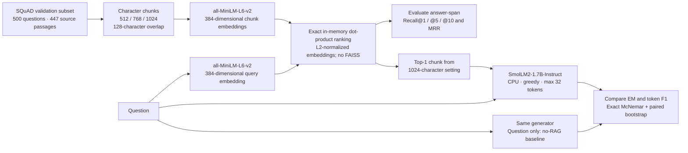

⚡ TinyRAG: CPU-Only Retrieval-Augmented Generation on a 16 GB Laptop
[![AAAI-27 manuscript\]\(https://img.shields.io/badge/AAAI--27-Student%20Abstract%20Manuscript-24292e?style=for-the-badge)](paper/experiment_summary.md)
 
 
 
 

  <b>A lightweight RAG evaluation with documented reproduction scripts for consumer laptop hardware without a GPU.</b> 
  <i>On a sampled, closed-corpus SQuAD task: <b>+31.8 percentage points</b> in Exact Match and <b>+0.3974</b> in token F1 over a matched no-RAG baseline. Evaluated on a CPU-only laptop with 16 GB of installed RAM.</i>

  <a href="#-system-architecture">Architecture</a> •
  <a href="#-key-experimental-results">Results</a> •
  <a href="#-experimental-figures">Figures</a> •
  <a href="#-hardware--system-profile">Hardware Profile</a> •
  <a href="#-reproduction-pipeline">Reproduction Guide</a> •
  <a href="#-citation">Citation</a>

🌟 Key Performance Highlights
🎯 Exact Match	📊 Token F1	🔍 Answer-span Recall@1	⏱️ Mean Generation Time	💻 Test Hardware
37.2% vs 5.4%
(+31.8 percentage points)	0.5179 vs 0.1205
(+0.3974 gain)	80.2% (Top-1)
97.2% (Top-10)	10.98 s / question
0 reported generation errors	CPU-only
Laptop with 16 GB installed RAM

📌 Overview
Many RAG evaluations use hardware or cloud services unavailable to individual researchers. TinyRAG measures how a conventional local RAG pipeline performs on one CPU-only laptop with 16 GB of installed RAM. It is an experimental baseline, not a new retrieval algorithm or a claim of state-of-the-art accuracy.
The evaluation uses 500 sampled SQuAD validation questions from 447 unique source passages. These passages form a closed retrieval corpus associated with the evaluation questions. TinyRAG combines sentence-transformers/all-MiniLM-L6-v2 (384-dimensional embeddings) with HuggingFaceTB/SmolLM2-1.7B-Instruct (1.7B-parameter generator). Only the 1024-character, top-1 setting was used for full question answering; all three chunk sizes were compared for retrieval.
🏛️ System Architecture
The workflow below reflects the implemented retrieval code. The README uses an inline diagram so it does not reproduce outdated labels in the older standalone architecture PNG.

```mermaid
flowchart LR
    A["SQuAD validation subset<br/>500 questions · 447 source passages"] --> B["Character chunks<br/>512 / 768 / 1024<br/>128-character overlap"]
    B --> C["all-MiniLM-L6-v2<br/>384-dimensional chunk embeddings"]
    Q["Question"] --> QE["all-MiniLM-L6-v2<br/>384-dimensional query embedding"]
    C --> R["Exact in-memory dot-product ranking<br/>L2-normalized embeddings; no FAISS"]
    QE --> R
    R --> RM["Evaluate answer-span<br/>Recall@1 / @5 / @10 and MRR"]
    R --> K["Top-1 chunk from<br/>1024-character setting"]
    K --> G["SmolLM2-1.7B-Instruct<br/>CPU · greedy · max 32 tokens"]
    Q --> G
    Q --> N["Same generator<br/>Question only: no-RAG baseline"]
    G --> E["Compare EM and token F1<br/>Exact McNemar + paired bootstrap"]
    N --> E
```
Figure 1: Corpus preparation, exact in-memory ranking, top-1 local generation, and paired evaluation. Retrieval scores are reported for all three chunk sizes; end-to-end generation uses only top-1 retrieval with 1024-character chunks.
The TinyRAG pipeline consists of four modular stages:
1. Knowledge Preparation: Deduplicate the SQuAD source passages and segment them using sliding-window chunking (512, 768, or 1024 characters with 128-character overlap).
2. Dense Retrieval: all-MiniLM-L6-v2 generates normalized 384-dimensional vectors. Exact in-memory dot products rank the chunks; the measured sub-millisecond timing covers this ranking step alone, not query encoding or the full retrieval pipeline. FAISS is not used.
3. CPU Generation: Supply the highest-ranked 1024-character chunk and question to SmolLM2-1.7B-Instruct. The matched no-RAG baseline uses the same model and question but no retrieved context. Generation uses four PyTorch threads, greedy decoding, and at most 32 new tokens.
4. Evaluation & Verification: Compare answer-span Recall@k and MRR for retrieval; compare Exact Match (EM), token F1, and mean generation time for RAG versus no-RAG. Paired inference uses the exact two-sided McNemar test and 10,000 question-level paired-bootstrap resamples.
📊 Key Experimental Results
1. Retrieval Performance Across Chunk Sizes
Evaluating answer-span retrieval over 447 sampled source passages (500 validation queries). A hit means a retrieved chunk fully contains the selected reference-answer span. These are closed-corpus results:
Chunk Size	Total Chunks	Recall@1 (%)	Recall@5 (%)	Recall@10 (%)	MRR	Mean Ranking Time	P95 Ranking Time
512 chars	1,005	72.8%	93.6%	95.2%	0.8166	0.206 ms	0.269 ms
768 chars	651	76.4%	94.0%	97.0%	0.8448	0.158 ms	0.209 ms
1024 chars (Best)	529	80.2%	95.2%	97.2%	0.8680	0.151 ms	0.197 ms

Finding: Of the three tested settings, 1024-character chunks had the highest answer-span Recall@1 (80.2%) and MRR (0.868), with 529 chunks. This configuration was chosen on the same sample used for evaluation, so its advantage has not been confirmed on a separate test set. Timing measures only in-memory similarity ranking with cached query embeddings.

2. End-to-End QA: TinyRAG vs. No-RAG Baseline
Full 500-question end-to-end evaluation using SmolLM2-1.7B-Instruct on CPU:
Configuration	Context Injected	Exact Match (EM)	Token F1	Mean Generation Time	Median Generation Time
No-RAG Baseline	None (Parametric only)	5.4%	0.1205	7.55 s / q	6.45 s / q
TinyRAG	1024-char Top-1 Chunk	37.2%	0.5179	10.98 s / q	10.37 s / q
Difference (RAG − No-RAG)	—	+31.8 percentage points	+0.3974	+3.43 s	+3.92 s

3. Statistical Significance & Reliability
- Paired Sample: 500 identical questions evaluated across both systems.
- McNemar's Exact Test: $p < 0.0001$ (TinyRAG correct & baseline wrong: 163; reverse: 4).
- Exact Match difference, 95% paired-bootstrap CI: +27.60 to +36.00 percentage points (10,000 question-level paired resamples; seed 42).
- Token F1 difference, 95% paired-bootstrap CI: +0.3595 to +0.4362. Shared source passages mean question-level intervals may be optimistic.
- Recorded generation errors: 0 for each 500-question run. This does not establish peak memory consumption or independently audited counts of all possible runtime faults.
📈 Experimental Figures
The repository currently includes the PNG experimental figures below; their generating script is scripts/22_make_figures.py. Do not assume the tracked PNGs are vector files. The README architecture uses the updated inline flowchart above, rather than the legacy figures/TinyRAG_Architecture.png.

Retrieval Recall vs. Chunk Size	Mean Reciprocal Rank (MRR)
	
Figure 2: Recall@1, 5, 10 across chunk lengths	Figure 3: MRR progression across chunk configurations

End-to-End Exact Match	End-to-End Token F1	Generation Latency Comparison
		
Figure 4: EM difference (+31.8 percentage points)	Figure 5: Token F1 difference (+0.3974)	Figure 6: Mean generation-time comparison on CPU

⚙️ Hardware & System Profile
The paper reports experiments on a consumer laptop. The following versions come from the saved system-profile snapshot, not from an immutable capture of the complete original generation environment:
Hardware Profile:
  Processor: Intel Core i7-10610U (4 physical cores, 8 logical threads)
  Installed RAM: approximately 16 GB (15.792 GB reported)
  Device: CPU-only (no discrete GPU used)
  PyTorch Threads: 4 intra-op / 4 inter-op (saved profile)
  Operating System: Windows 11 (AMD64)
  Snapshot Python Version: 3.11.16
  Snapshot PyTorch Version: 2.14.0+cpu
The saved snapshot is in [`results/system_profile.json`](results/system_profile.json) and [`results/system_profile.csv`](results/system_profile.csv). Important: the JSON records import failures for Transformers, sentence-transformers, pandas, and scikit-learn when that later profile was captured. It is not a verified, complete environment lock for the successful runs. Mean available system RAM during generation was 2.56 GB (TinyRAG) and 2.49 GB (no-RAG); it is not measured peak process memory.

🔬 Research Scope & Reproducibility Notes
- Research scope: a measured dense-retrieval baseline on 500 sampled SQuAD validation questions and a corpus composed of the 447 passages associated with those questions. This is not an open-domain benchmark or a new retrieval method.
- Configuration selection: chunk sizes 512/768/1024 were compared on the evaluation sample; the 1024-character configuration was selected on that same sample and was the only configuration used for full 500-question RAG generation.
- Retrieval versus generation: Recall@k means answer-span recall; 0.151 ms measures cached-embedding ranking only. 10.98 s measures mean generation time, not full end-to-end latency.
- Answer scoring: the evaluation uses single-reference scoring against the first provided SQuAD reference answer, rather than all reference answers. Shared contexts among questions can make question-level bootstrap intervals too narrow.
- Environment: requirements.txt lists lower-bound constraints (>=), not versions frozen during the experiment. The later system snapshot includes package-import failures; it should not be used as an exact reproducibility manifest. Recover and record original revisions if they remain available.
- Raw outputs: original per-question outputs are not currently tracked. Scripts can generate new outputs, but those are not independent verification of the originally reported observations unless they match under a controlled environment.
📂 Repository Structure
TinyRAG/
├── .gitignore                    # Strict exclusions for caches, weights, and logs
├── README.md                     # Project documentation & reproduction instructions
├── requirements.txt              # Minimum version constraints; not a lock file
├── figures/                      # Publication figures and architecture diagram
│   ├── TinyRAG_Architecture.png  # Legacy image (update labels before reusing)
│   ├── Figure_1_Retrieval_Recall.png
│   ├── Figure_2_MRR.png
│   ├── Figure_3_End_to_End_EM.png
│   ├── Figure_4_End_to_End_F1.png
│   └── Figure_5_Generation_Latency.png
├── paper/
│   ├── experiment_summary.md     # Full metric breakdown and parameter configurations
│   └── tables/                   # Paper-ready tables in Markdown and CSV format
│       ├── paper_tables.md
│       ├── table1_retrieval_results.csv
│       ├── table2_end_to_end_results.csv
│       └── table3_statistical_comparison.csv
├── results/
│   ├── final/                    # Aggregated statistical summaries
│   │   ├── end_to_end_statistical_summary.csv
│   │   └── final_results_table.csv
│   ├── comparison/
│   │   └── rag_vs_baseline_summary.csv
│   ├── retrieval/
│   │   └── retrieval_summary.csv
│   ├── system_profile.csv        # Later hardware/software snapshot (not a lock file)
│   └── system_profile.json       # Later JSON profile; records some import errors
└── scripts/                      # Sequential, reproducible execution pipeline
    ├── config.py                 # Fully portable directory and environment paths
    ├── logger.py                 # Centralized timestamped logging
    ├── checkpoint.py             # Atomic checkpointing for long runs
    ├── 01_environment.py         # Hardware and runtime environment validation
    ├── 04_prepare_dataset.py     # SQuAD download and seed-42 validation split sampling
    ├── 05_verify_dataset.py      # Dataset integrity validation
    ├── 06_create_chunks.py       # Sliding window text chunking
    ├── 08_create_gold_mapping.py  # Chunk-to-gold document mapping
    ├── 09_embed_corpus.py        # Dense embedding generation via MiniLM
    ├── 10_retrieval_eval.py      # Retrieval evaluation (Recall@K, MRR, latency)
    ├── 18_rag_eval.py            # 500-question TinyRAG generation
    ├── 19_baseline_eval.py       # 500-question No-RAG baseline generation
    ├── 20_compare_rag_baseline.py# Paired McNemar and bootstrap analysis
    ├── 21_make_results_table.py  # Result table generation
    ├── 22_make_figures.py        # 600 DPI publication figure generation
    ├── 23_make_paper_tables.py   # Paper table generator
    └── 24_system_profile.py      # Automated hardware profiler
🚀 Reproduction Pipeline
The scripts below describe the intended experimental workflow and can regenerate results when dependencies and model artifacts are available. Exact numerical reproduction is not guaranteed: requirements.txt uses minimum-version constraints, model revisions and the dataset revision are not pinned, and original question-level prediction files are not tracked. Use a fresh environment, record its resolved package versions and model revisions, and compare any regenerated outputs with the published summary tables.
1. Environment Setup
git clone https://github.com/Hasnain006-nain/TinyRAG.git
cd TinyRAG
pip install -r requirements.txt
2. Dataset & Chunk Preparation
# Verify environment configuration
python scripts/01_environment.py

# Download SQuAD validation split and sample 500 questions (seed 42)
python scripts/04_prepare_dataset.py
python scripts/05_verify_dataset.py

# Partition corpus into 512, 768, and 1024-character sliding windows
python scripts/06_create_chunks.py
python scripts/08_create_gold_mapping.py
3. Embedding & Retrieval Evaluation
# Compute dense embeddings with sentence-transformers/all-MiniLM-L6-v2
python scripts/09_embed_corpus.py

# Benchmark retrieval recall and MRR across chunk configurations
python scripts/10_retrieval_eval.py
4. End-to-End Generation & Statistical Analysis
# Execute full 500-question TinyRAG generation (Top-1 1024-char chunk)
python scripts/18_rag_eval.py

# Execute full 500-question parametric No-RAG baseline
python scripts/19_baseline_eval.py

# Run paired McNemar test and 10,000 bootstrap iterations
python scripts/20_compare_rag_baseline.py

# Compile final result tables, high-resolution figures, and system profile
python scripts/21_make_results_table.py
python scripts/22_make_figures.py
python scripts/23_make_paper_tables.py
python scripts/24_system_profile.py
Artifact policy: Model caches (hf_cache/), embedding matrices (embeddings/*.npy), raw generated data, original per-question prediction files, logs, and large intermediate artifacts are excluded by .gitignore. The published aggregate results support a numerical consistency check, but do not allow independent recomputation of paired statistics without rerunning the original models or obtaining the original question-level outputs. Seed 42 controls sampling/bootstrap; it does not guarantee bit-for-bit reproducibility across library versions or model revisions.

📖 Citation
If you use TinyRAG in your research, please cite:
@misc{haider2026tinyrag,
  author       = {Haider, Hasnain},
  title        = {TinyRAG: Evaluating Retrieval-Augmented Generation on a 16 GB CPU-Only Laptop},
  year         = {2026},
  howpublished = {GitHub repository and manuscript prepared for the AAAI-27 Student Abstract and Poster Program},
  url          = {https://github.com/Hasnain006-nain/TinyRAG},
  note         = {Unpublished manuscript; update the citation only after a confirmed publication}
}

  Research manuscript prepared for the AAAI-27 Student Abstract and Poster Program. Repository released under the <a href="LICENSE">MIT License</a>. This badge does not indicate acceptance or publication.

