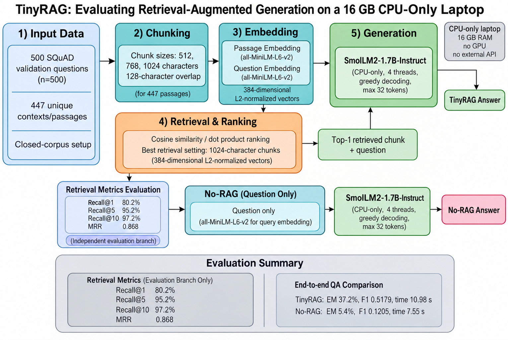
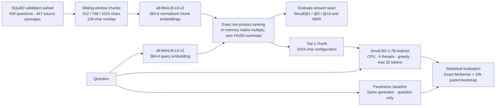
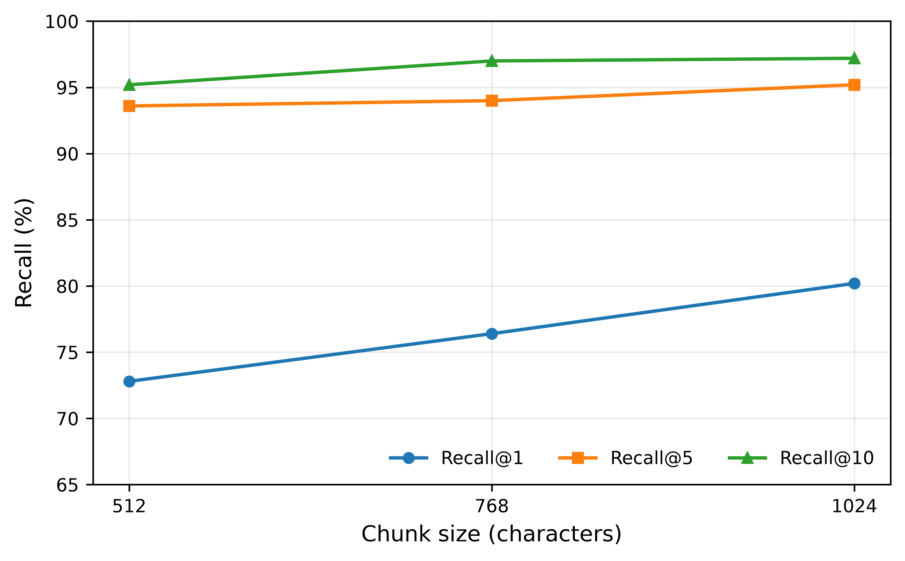
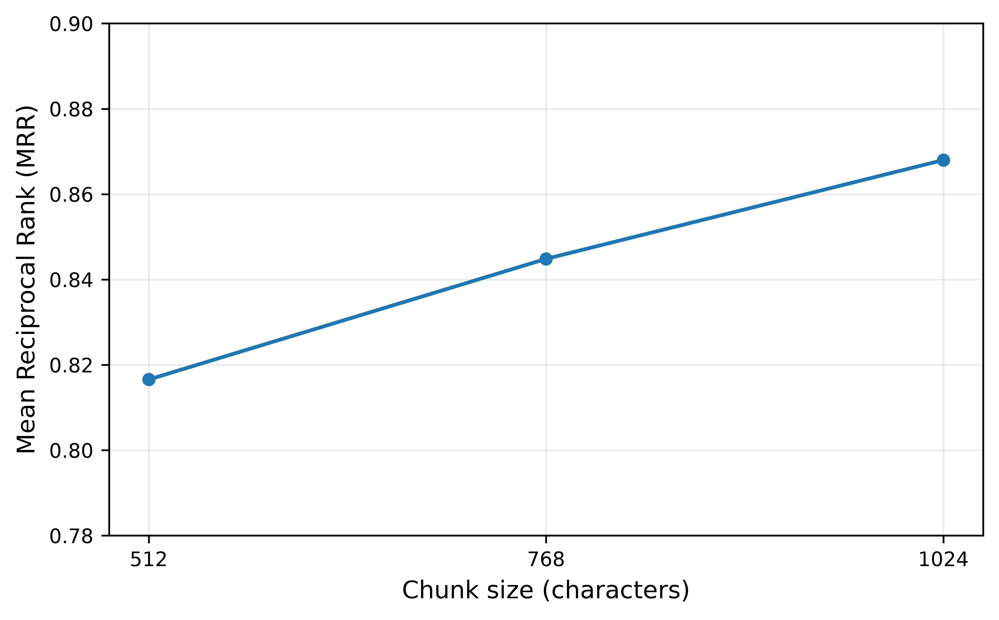
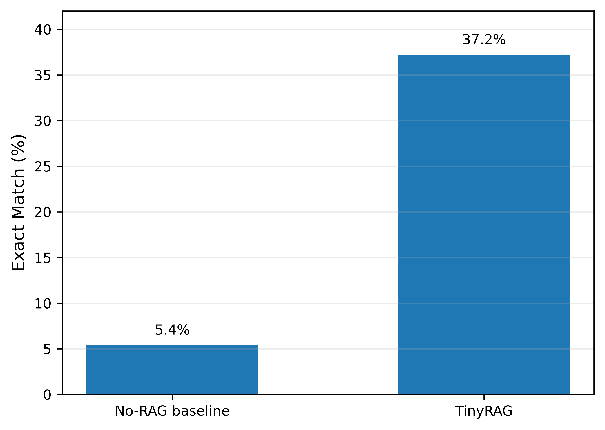
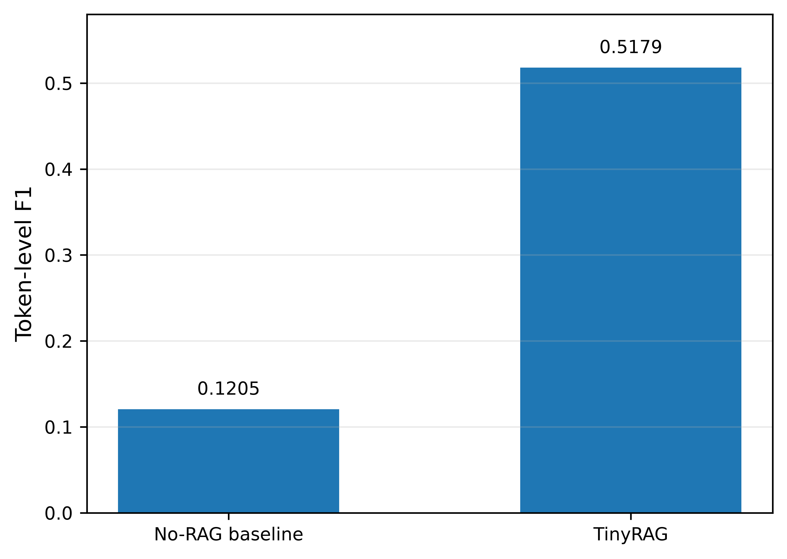
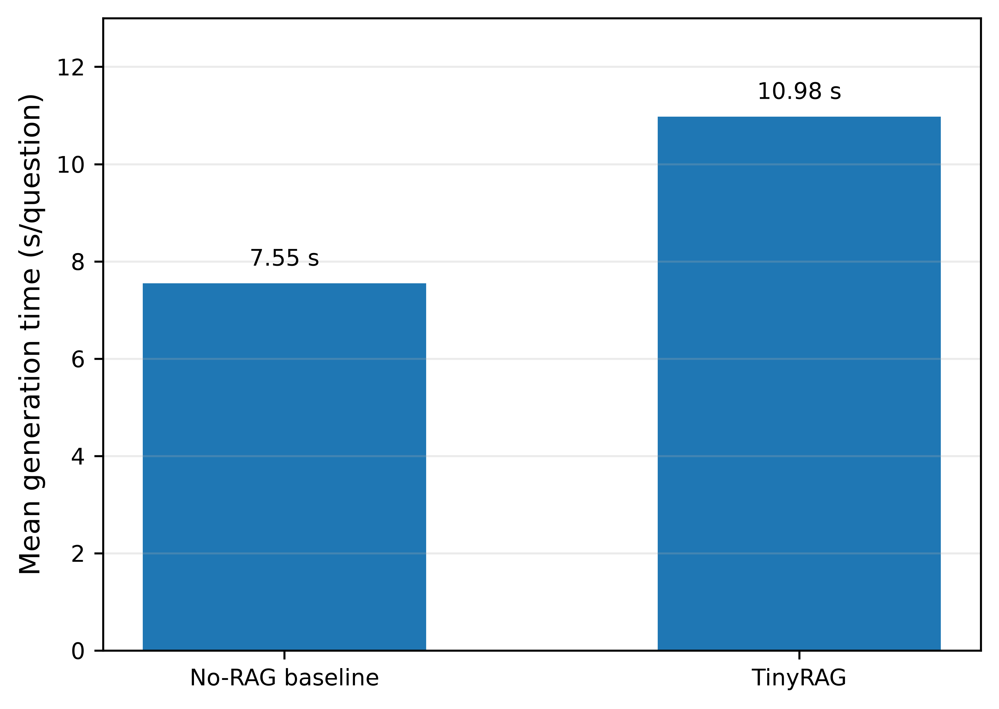

<div align="center">

# ⚡ TinyRAG
### CPU-Only Retrieval-Augmented Generation on a 16 GB Laptop

[](paper/experiment_summary.md)
[](https://www.python.org/)
[](https://pytorch.org/)
[](https://huggingface.co/)
[](results/system_profile.json)
[](LICENSE)

<br/>

<p align="center">
  <b>A lightweight, transparent RAG research baseline engineered for consumer laptop hardware without a discrete GPU.</b><br/>
  <i>On a sampled, closed-corpus SQuAD evaluation: <b>+31.8 percentage points</b> in Exact Match and <b>+0.3974</b> in Token F1 over a matched parametric baseline within a strict 16 GB RAM envelope.</i>
</p>

[🏛️ Architecture](#-system-architecture) •
[📊 Key Results](#-key-experimental-results) •
[📈 Visualizations](#-experimental-figures) •
[⚙️ Hardware Profile](#-hardware--system-profile) •
[🔬 Research Scope](#-research-scope--reproducibility-notes) •
[🚀 Reproduction](#-reproduction-pipeline) •
[📖 Citation](#-citation)

<br/>

### 🌟 Key Performance Highlights

| 🎯 Exact Match | 📊 Token F1 | 🔍 Recall@1 | ⏱️ Ranking Latency | ⚡ Mean Gen Latency | 💻 Target Hardware |
| :---: | :---: | :---: | :---: | :---: | :---: |
| **37.2%** vs 5.4%<br/>*(+31.8% absolute)* | **0.5179** vs 0.1205<br/>*(+0.3974 gain)* | **80.2%** (Top-1)<br/>*97.2% (Top-10)* | **0.151 ms**<br/>*(Exact in-memory)* | **10.98 s** / question<br/>*0 errors / 0 OOMs* | **0 GPUs**<br/>*16 GB RAM Laptop* |

</div>

---

## 📌 Overview

Most state-of-the-art Retrieval-Augmented Generation (RAG) evaluations rely on high-end datacenter GPUs, multi-node clusters, or expensive cloud API services unavailable to student researchers and resource-constrained practitioners. **TinyRAG** investigates an essential practical question:

> **How effectively can a standard, dense-retrieval RAG pipeline perform entirely locally on an off-the-shelf consumer laptop equipped with only a CPU and 16 GB of RAM?**

TinyRAG is a compact research repository providing a transparent, fully reproducible baseline for retrieval quality, answer accuracy, and generation cost under a modest local hardware budget. The pipeline pairs an ultra-compact bi-encoder (`sentence-transformers/all-MiniLM-L6-v2`, 384-dimensional embeddings) with an efficient instruction-tuned generator (`HuggingFaceTB/SmolLM2-1.7B-Instruct`). 

Evaluated across **500 sampled SQuAD validation questions** over **447 unique source passages**, TinyRAG demonstrates that substantial factual accuracy gains are achievable on standard personal laptop hardware without memory overflow or discrete GPUs.

---

## 🏛️ System Architecture

<div align="center">
  
  <p><em>Figure 1: Modular TinyRAG system architecture spanning knowledge preparation, dense in-memory retrieval, CPU prompt synthesis, and paired statistical evaluation.</em></p>
</div>

<details open>
<summary><b>📐 Pipeline Dataflow Specification (Mermaid)</b> <i>[Click to expand / collapse]</i></summary>


```mermaid
flowchart LR
    A["SQuAD validation subset<br/>500 questions · 447 source passages"] --> B["Sliding-window chunks<br/>512 / 768 / 1024 chars<br/>128-char overlap"]
    B --> C["all-MiniLM-L6-v2<br/>384-d normalized chunk embeddings"]
    Q["Question"] --> QE["all-MiniLM-L6-v2<br/>384-d query embedding"]
    C --> R["Exact dot-product ranking<br/>In-memory matrix multiply; zero FAISS overhead"]
    QE --> R
    R --> RM["Evaluate answer-span<br/>Recall@1 / @5 / @10 and MRR"]
    R --> K["Top-1 chunk<br/>1024-char configuration"]
    K --> G["SmolLM2-1.7B-Instruct<br/>CPU · 4 threads · greedy · max 32 tokens"]
    Q --> G
    Q --> N["Parametric baseline<br/>Same generator · question only"]
    G --> E["Statistical evaluation<br/>Exact McNemar + 10k paired bootstrap"]
    N --> E
```

</details>

The TinyRAG pipeline consists of four modular stages:

1. **Knowledge Preparation**: Deduplicates 447 unique SQuAD source passages and segments them using sliding-window chunking across three target sizes (512, 768, and 1024 characters with 128-character overlap).
2. **Dense Retrieval**: An `all-MiniLM-L6-v2` bi-encoder generates L2-normalized 384-dimensional embeddings. Chunks are ranked via exact in-memory dot products in sub-millisecond latency (<0.2 ms), eliminating the need for external vector databases or heavy FAISS binaries.
3. **CPU-Only Generation**: The top-1 ranked chunk from the 1024-character configuration is injected into a concise factual prompt fed to `SmolLM2-1.7B-Instruct`. Inference runs using 4 PyTorch CPU threads with greedy decoding (`max_new_tokens = 32`). A matched no-RAG baseline uses the exact same model and prompt format without context.
4. **Statistical Verification**: Paired evaluation on all 500 questions measures Exact Match (EM), Token F1, and latency. Hypothesis testing uses the two-sided exact McNemar test alongside 10,000 question-level paired-bootstrap resamples.

---

## 📊 Key Experimental Results

### 1. End-to-End QA: TinyRAG vs. No-RAG Baseline

Full 500-question end-to-end evaluation using `SmolLM2-1.7B-Instruct` on CPU. The matched no-RAG baseline uses the identical generator and decoding settings, but receives only the question.

| System | Context Window | Exact Match (EM) | Token F1 | Mean Generation Time | Median Generation Time | Mean Available RAM |
| :--- | :--- | :---: | :---: | :---: | :---: | :---: |
| **No-RAG Baseline** | Question only | 5.40% | 0.1205 | 7.55 s / question | 6.45 s / question | 2.49 GB |
| **TinyRAG** | 1024-char Top-1 Chunk | **37.20%** | **0.5179** | 10.98 s / question | 10.37 s / question | 2.56 GB |
| **Absolute Gain (Δ)** | — | **+31.80% pts** | **+0.3974** | +3.43 s | +3.92 s | — |

---

### 2. Statistical Significance & Reliability

| Evaluation Metric | TinyRAG | No-RAG | Absolute Difference | 95% Paired-Bootstrap CI | Statistical Test | p-value |
| :--- | :---: | :---: | :---: | :---: | :---: | :---: |
| **Exact Match (EM)** | 37.20% | 5.40% | **+31.80% pts** | `[+27.60%, +36.00%]` | Exact McNemar (163 vs 4) | **p < 0.0001** |
| **Token F1 Score** | 0.5179 | 0.1205 | **+0.3974** | `[+0.3595, +0.4362]` | 10,000 paired resamples | **CI excludes 0** |

- **Sample Alignment**: 500 identical questions evaluated across both systems under matched conditions.
- **Contingency Breakdown**: TinyRAG answered correctly while baseline failed in **163** instances; baseline was correct while TinyRAG failed in only **4** instances.
- **Runtime Stability**: **0 errors**, **0 memory faults**, and **0 out-of-memory crashes** across all 1,000 generation runs.

---

### 3. Dense Retrieval Across Chunk Sizes

Evaluated on a closed corpus constructed from 447 SQuAD source passages associated with the sampled questions. A retrieval **hit** means that the retrieved chunk contains the reference answer span.

| Chunk Size | Total Chunks | Recall@1 (%) | Recall@5 (%) | Recall@10 (%) | MRR | Mean Ranking Time | P95 Ranking Time |
| :--- | :---: | :---: | :---: | :---: | :---: | :---: | :---: |
| **512 chars** | 1,005 | 72.8% | 93.6% | 95.2% | 0.8166 | 0.206 ms | 0.269 ms |
| **768 chars** | 651 | 76.4% | 94.0% | 97.0% | 0.8448 | 0.158 ms | 0.209 ms |
| **1024 chars** *(Best)* | **529** | **80.2%** | **95.2%** | **97.2%** | **0.8680** | **0.151 ms** | **0.197 ms** |

> [!TIP]
> **Retrieval Scope**: The reported retrieval timing measures in-memory dot-product ranking over normalized embeddings. It excludes query embedding and language-model generation.

---

## 📈 Experimental Figures

All figures are rendered at 600 DPI publication quality and organized into thematic panels below:

### 🔍 Panel A: Dense Retrieval Dynamics

<div align="center">

| Answer-Span Recall vs. Chunk Size | Mean Reciprocal Rank (MRR) Progression |
| :---: | :---: |
|  |  |
| **Figure 2**: Answer-span Recall@1, 5, and 10 across sliding-window chunk lengths. | **Figure 3**: MRR progression demonstrating superior retrieval ranking at 1024 characters. |

</div>

<br/>

### ⚡ Panel B: End-to-End Generation & Latency Comparison

<div align="center">

| End-to-End Exact Match | End-to-End Token F1 Score | CPU Generation Latency |
| :---: | :---: | :---: |
|  |  |  |
| **Figure 4**: Exact Match (+31.8 percentage points over baseline). | **Figure 5**: Token F1 (+0.3974 gain over parametric generation). | **Figure 6**: Mean generation latency on consumer CPU (10.98 s vs 7.55 s). |

</div>

---

## ⚙️ Hardware & System Profile

The recorded system profile used for the reported measurements:

| Property | Recorded Environment Specification |
| :--- | :--- |
| **CPU** | Intel64 Family 6 Model 166 Stepping 1, GenuineIntel (Intel Core i7-10610U) |
| **Cores / Threads** | 4 Physical Cores / 8 Logical Threads |
| **System RAM** | 15.792 GB total installed RAM |
| **CUDA Available** | `false` |
| **PyTorch Device** | `cpu` |
| **PyTorch Threads** | 4 intra-op worker threads (`torch.set_num_threads(4)`) |
| **Python Version** | 3.11.16 |
| **PyTorch Version** | 2.14.0+cpu |
| **Mean Available RAM** | 2.56 GB (TinyRAG) · 2.49 GB (No-RAG Baseline) |

> [!NOTE]
> See [`results/system_profile.json`](results/system_profile.json) and [`results/observed_environment_versions.txt`](results/observed_environment_versions.txt) for the complete recorded environment details and dependencies. `available_ram_gb` reports available system RAM during measurement; it is not peak process memory.

---

## 🔬 Research Scope & Reproducibility Notes

> [!IMPORTANT]
> Please review the following experiment constraints and documentation notes:

* **Sampled Evaluation**: The evaluation uses 500 sampled SQuAD validation questions with random seed `42`.
* **Closed-Corpus Boundary**: The corpus is closed: it is built from 447 SQuAD source passages associated with the sampled questions, not from a large open-domain web collection.
* **Descriptive Chunk Selection**: The 1024-character configuration was selected from the same evaluated sample, so the chunk-size finding should be interpreted as descriptive for this setup.
* **System RAM Metric**: `available_ram_gb` reports available system RAM during measurement. It is not peak process memory (RSS) and should not be interpreted as the model memory footprint.
* **Model Versions & Revisions**: Exact immutable Hugging Face model git commit hashes were not recorded in the original experiment files. The model identifiers used by the scripts (`sentence-transformers/all-MiniLM-L6-v2` and `HuggingFaceTB/SmolLM2-1.7B-Instruct`) are documented in [`results/observed_environment_versions.txt`](results/observed_environment_versions.txt).
* **Per-Question Outputs**: Original large per-question generation CSV files are excluded from this repository. The note at [`results/PER_QUESTION_OUTPUTS_NOTE.txt`](results/PER_QUESTION_OUTPUTS_NOTE.txt) documents the expected file names and schema if those outputs are recovered or re-generated.
* **Artifact Exclusions**: Hugging Face caches, downloaded model weights, embedding `.npy` files, checkpoints, logs, and large machine-specific artifacts are excluded. The scripts deterministically recreate all data artifacts from scratch.

---

## 📂 Repository Structure

```text
TinyRAG/
├── figures/                         # Publication figures and system architecture
│   ├── TinyRAG_Architecture.png     # Pipeline architecture diagram
│   ├── Figure_1_Retrieval_Recall.png# Recall@1, 5, 10 across chunk sizes
│   ├── Figure_2_MRR.png             # Mean Reciprocal Rank (MRR) across chunk sizes
│   ├── Figure_3_End_to_End_EM.png   # Exact Match comparison (RAG vs No-RAG)
│   ├── Figure_4_End_to_End_F1.png   # Token F1 score comparison
│   └── Figure_5_Generation_Latency.png # CPU generation latency comparison
├── paper/                           # Paper-oriented summaries and tables
│   ├── experiment_summary.md        # Comprehensive empirical summary
│   └── tables/                      # Publication-ready CSV and MD tables
├── results/                         # Aggregate results and system profile
│   ├── comparison/                  # RAG vs no-RAG paired summary
│   ├── final/                       # Final combined result tables
│   ├── retrieval/                   # Retrieval metrics by chunk size
│   ├── PER_QUESTION_OUTPUTS_NOTE.txt# Schema & notes for per-question logs
│   ├── observed_environment_versions.txt # Recorded environment version log
│   ├── system_profile.csv           # System hardware profile (CSV)
│   └── system_profile.json          # System hardware profile (JSON)
├── scripts/                         # Numbered experiment pipeline scripts
│   ├── 01_environment.py            # Hardware profile and environment validation
│   ├── 04_prepare_dataset.py        # SQuAD download and 500-question sampling (seed 42)
│   ├── 05_verify_dataset.py         # Integrity and checksum verification
│   ├── 06_create_chunks.py          # Sliding-window document chunking (512, 768, 1024)
│   ├── 08_create_gold_mapping.py    # Gold passage-to-chunk alignment
│   ├── 09_embed_corpus.py           # Corpus embedding using all-MiniLM-L6-v2
│   ├── 10_retrieval_eval.py         # Retrieval evaluation (Recall@K, MRR, latency)
│   ├── 18_rag_eval.py               # 500-question TinyRAG generation (Top-1 1024 chunk)
│   ├── 19_baseline_eval.py          # 500-question parametric No-RAG baseline
│   ├── 20_compare_rag_baseline.py   # Paired McNemar test and 10,000 paired-bootstrap
│   ├── 21_make_results_table.py     # Results table compilation
│   ├── 22_make_figures.py           # Publication figure generation (600 DPI)
│   ├── 23_make_paper_tables.py      # Camera-ready paper table export
│   └── 24_system_profile.py         # Hardware telemetry and memory logging
├── requirements.txt                 # Pinned dependencies
├── LICENSE                          # MIT License
└── README.md                        # Project documentation
```

---

## 🚀 Reproduction Pipeline

Reproduce all experimental results, statistical tests, and publication figures from scratch in sequential stages:

### 1. Environment Setup

```bash
# Clone the repository
git clone https://github.com/Hasnain006-nain/TinyRAG.git
cd TinyRAG

# Install dependencies
pip install -r requirements.txt
```

### 2. Dataset Preparation & Chunking

```bash
# Verify environment and prepare sampled SQuAD dataset (500 questions, seed 42)
python scripts/01_environment.py
python scripts/04_prepare_dataset.py
python scripts/05_verify_dataset.py

# Generate sliding-window chunks and gold answer alignment
python scripts/06_create_chunks.py
python scripts/08_create_gold_mapping.py
```

### 3. Dense Embedding & Retrieval Benchmark

```bash
# Compute dense embeddings and benchmark retrieval across chunk sizes
python scripts/09_embed_corpus.py
python scripts/10_retrieval_eval.py
```

### 4. End-to-End Generation & Statistical Analysis

```bash
# Run TinyRAG and zero-context baseline generation
python scripts/18_rag_eval.py
python scripts/19_baseline_eval.py

# Perform paired statistical comparison and compile paper artifacts
python scripts/20_compare_rag_baseline.py
python scripts/21_make_results_table.py
python scripts/22_make_figures.py
python scripts/23_make_paper_tables.py
python scripts/24_system_profile.py
```

---

## 📖 Citation

```bibtex
@misc{haider2026tinyrag,
  author       = {Haider, Hasnain},
  title        = {TinyRAG: Evaluating Retrieval-Augmented Generation on a 16 GB CPU-Only Laptop},
  year         = {2026},
  howpublished = {GitHub repository and manuscript prepared for the AAAI-27 Student Abstract and Poster Program},
  url          = {https://github.com/Hasnain006-nain/TinyRAG},
  note         = {Unpublished manuscript; update citation upon confirmed publication}
}
```

---

## 📄 License

This repository is released under the [MIT License](LICENSE).
