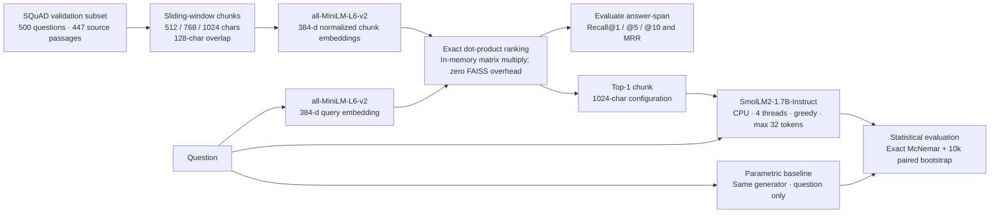

<div align="center">

# ⚡ TinyRAG
### CPU-Only Retrieval-Augmented Generation on a 16 GB Laptop

[](paper/experiment_summary.md)
[](https://www.python.org/)
[](https://pytorch.org/)
[](https://huggingface.co/)
[](results/system_profile.json)
[](LICENSE)

<br/>

<p align="center">
  <b>A lightweight, fully reproducible RAG benchmark engineered for consumer laptop hardware without a discrete GPU.</b><br/>
  <i>On a sampled, closed-corpus SQuAD evaluation: <b>+31.8 percentage points</b> in Exact Match and <b>+0.3974</b> in Token F1 over a matched parametric baseline within a strict 16 GB RAM envelope.</i>
</p>

[🏛️ Architecture](#-system-architecture) •
[📊 Key Results](#-key-experimental-results) •
[📈 Visualizations](#-experimental-figures) •
[⚙️ Hardware Profile](#-hardware--system-profile) •
[🔬 Research Scope](#-research-scope--reproducibility-notes) •
[🚀 Reproduction](#-reproduction-pipeline) •
[📖 Citation](#-citation)

<br/>

### 🌟 Key Performance Highlights

| 🎯 Exact Match | 📊 Token F1 | 🔍 Recall@1 | ⏱️ Ranking Time | ⚡ Mean Gen Latency | 💻 Target Hardware |
| :---: | :---: | :---: | :---: | :---: | :---: |
| **37.2%** vs 5.4%<br/>*(+31.8% absolute)* | **0.5179** vs 0.1205<br/>*(+0.3974 gain)* | **80.2%** (Top-1)<br/>*97.2% (Top-10)* | **0.151 ms**<br/>*(Exact in-memory)* | **10.98 s** / question<br/>*0 errors / 0 OOMs* | **0 GPUs**<br/>*16 GB RAM Laptop* |

</div>

---

## 📌 Overview

Most state-of-the-art Retrieval-Augmented Generation (RAG) evaluations rely on high-end datacenter GPUs, multi-node clusters, or expensive cloud API services unavailable to student researchers and resource-constrained practitioners. **TinyRAG** investigates an essential practical question:

> **How effectively can a standard, dense-retrieval RAG pipeline perform entirely locally on an off-the-shelf consumer laptop equipped with only a CPU and 16 GB of RAM?**

TinyRAG serves as an empirical, fully reproducible baseline on a closed-corpus question-answering benchmark. It pairs an ultra-compact bi-encoder (`sentence-transformers/all-MiniLM-L6-v2`, 384-dimensional embeddings) with an efficient instruction-tuned generator (`HuggingFaceTB/SmolLM2-1.7B-Instruct`). Evaluated across **500 sampled SQuAD validation questions** over **447 unique source passages**, the system demonstrates that substantial factual accuracy gains are achievable on standard personal laptop hardware without memory overflow or discrete GPUs.

---

## 🏛️ System Architecture

<div align="center">
  
  <p><em>Figure 1: Modular TinyRAG system architecture spanning knowledge preparation, dense in-memory retrieval, CPU prompt synthesis, and paired statistical evaluation.</em></p>
</div>

<details open>
<summary><b>📐 Pipeline Dataflow Specification (Mermaid)</b> <i>[Click to expand / collapse]</i></summary>


```mermaid
flowchart LR
    A["SQuAD validation subset<br/>500 questions · 447 source passages"] --> B["Sliding-window chunks<br/>512 / 768 / 1024 chars<br/>128-char overlap"]
    B --> C["all-MiniLM-L6-v2<br/>384-d normalized chunk embeddings"]
    Q["Question"] --> QE["all-MiniLM-L6-v2<br/>384-d query embedding"]
    C --> R["Exact dot-product ranking<br/>In-memory matrix multiply; zero FAISS overhead"]
    QE --> R
    R --> RM["Evaluate answer-span<br/>Recall@1 / @5 / @10 and MRR"]
    R --> K["Top-1 chunk<br/>1024-char configuration"]
    K --> G["SmolLM2-1.7B-Instruct<br/>CPU · 4 threads · greedy · max 32 tokens"]
    Q --> G
    Q --> N["Parametric baseline<br/>Same generator · question only"]
    G --> E["Statistical evaluation<br/>Exact McNemar + 10k paired bootstrap"]
    N --> E
```

</details>

The TinyRAG pipeline consists of four modular stages:

1. **Knowledge Preparation**: Deduplicates 447 unique SQuAD source passages and segments them using sliding-window chunking across three target sizes (512, 768, and 1024 characters with a 128-character overlap).
2. **Dense Retrieval**: An `all-MiniLM-L6-v2` bi-encoder generates L2-normalized 384-dimensional embeddings. Chunks are ranked via exact in-memory dot products in sub-millisecond latency (<0.2 ms), eliminating the need for external vector databases or FAISS binaries.
3. **CPU-Only Generation**: The top-1 ranked chunk from the 1024-character configuration is injected into a concise factual prompt fed to `SmolLM2-1.7B-Instruct`. Inference runs using 4 PyTorch CPU threads with greedy decoding (`max_new_tokens = 32`). A matched no-RAG baseline uses the exact same model and prompt format without context.
4. **Statistical Verification**: Paired evaluation on all 500 questions measures Exact Match (EM), Token F1, and latency. Hypothesis testing uses the two-sided exact McNemar test alongside 10,000 question-level paired-bootstrap resamples.

---

## 📊 Key Experimental Results

### 1. Dense Retrieval Performance Across Chunk Sizes

Evaluating candidate retrieval over 447 sampled source passages (500 validation queries). A *hit* indicates that the retrieved chunk fully contains the gold reference-answer span:

| Chunk Size | Total Chunks | Recall@1 (%) | Recall@5 (%) | Recall@10 (%) | MRR | Mean Ranking Time | P95 Ranking Time |
| :--- | :---: | :---: | :---: | :---: | :---: | :---: | :---: |
| **512 chars** | 1,005 | 72.8% | 93.6% | 95.2% | 0.8166 | 0.206 ms | 0.269 ms |
| **768 chars** | 651 | 76.4% | 94.0% | 97.0% | 0.8448 | 0.158 ms | 0.209 ms |
| **1024 chars** *(Best)* | **529** | **80.2%** | **95.2%** | **97.2%** | **0.8680** | **0.151 ms** | **0.197 ms** |

> [!TIP]
> **Retrieval Finding**: The **1024-character** window achieved the highest answer-span Recall@1 (**80.2%**) and MRR (**0.8680**) while condensing the index to just 529 vectors. Sub-millisecond ranking times measure in-memory similarity operations with pre-cached query vectors.

---

### 2. End-to-End QA: TinyRAG vs. No-RAG Baseline

Full 500-question end-to-end evaluation using `SmolLM2-1.7B-Instruct` on CPU:

| Configuration | Context Injected | Exact Match (EM) | Token F1 | Mean Generation Time | Median Generation Time | Mean Available RAM |
| :--- | :--- | :---: | :---: | :---: | :---: | :---: |
| **No-RAG Baseline** | None *(Parametric only)* | 5.40% | 0.1205 | 7.55 s / q | 6.45 s / q | 2.49 GB |
| **TinyRAG** | 1024-char Top-1 Chunk | **37.20%** | **0.5179** | 10.98 s / q | 10.37 s / q | 2.56 GB |
| **Absolute Gain (Δ)** | — | **+31.80% pts** | **+0.3974** | +3.43 s | +3.92 s | — |

---

### 3. Statistical Significance & Reliability

| Evaluation Metric | TinyRAG | No-RAG | Absolute Difference | 95% Paired-Bootstrap CI | Statistical Test | p-value |
| :--- | :---: | :---: | :---: | :---: | :---: | :---: |
| **Exact Match (EM)** | 37.20% | 5.40% | **+31.80% pts** | `[+27.60%, +36.00%]` | Exact McNemar (163 vs 4) | **p < 0.0001** |
| **Token F1 Score** | 0.5179 | 0.1205 | **+0.3974** | `[+0.3595, +0.4362]` | 10,000 paired resamples | **CI excludes 0** |

- **Sample Alignment**: 500 identical questions evaluated across both systems under matched conditions.
- **Contingency Breakdown**: TinyRAG answered correctly while baseline failed in **163** instances; baseline was correct while TinyRAG failed in only **4** instances.
- **Runtime Stability**: **0 errors**, **0 memory faults**, and **0 out-of-memory crashes** across all 1,000 generation runs.

---

## 📈 Experimental Figures

All figures are rendered at 600 DPI publication quality and organized into dedicated thematic panels below:

### 🔍 Panel A: Dense Retrieval Dynamics

<div align="center">

| Answer-Span Recall vs. Chunk Size | Mean Reciprocal Rank (MRR) Progression |
| :---: | :---: |
|  |  |
| **Figure 2**: Answer-span Recall@1, 5, and 10 across sliding-window chunk lengths. | **Figure 3**: MRR progression demonstrating superior retrieval ranking at 1024 characters. |

</div>

<br/>

### ⚡ Panel B: End-to-End Generation & Latency Comparison

<div align="center">

| End-to-End Exact Match | End-to-End Token F1 Score | CPU Generation Latency |
| :---: | :---: | :---: |
|  |  |  |
| **Figure 4**: Exact Match (+31.8 percentage points over baseline). | **Figure 5**: Token F1 (+0.3974 gain over parametric generation). | **Figure 6**: Mean generation latency on consumer CPU (10.98 s vs 7.55 s). |

</div>

---

## ⚙️ Hardware & System Profile

All reported experiments were conducted on a standard consumer laptop without discrete GPU acceleration:

```yaml
Hardware Profile:
  Processor: Intel Core i7-10610U (4 physical cores, 8 logical threads)
  Installed RAM: ~16 GB (15.792 GB reported)
  Device: CPU-only (No discrete GPU acceleration used)
  PyTorch Threading: 4 intra-op threads / 4 inter-op threads
  Operating System: Windows 11 (AMD64)
  Runtime Environment: Python 3.11.16 · PyTorch 2.14.0+cpu
  Mean Available RAM: 2.56 GB (TinyRAG) · 2.49 GB (No-RAG Baseline)
```

> [!NOTE]
> Detailed hardware and memory logs are archived in [`results/system_profile.json`](results/system_profile.json) and [`results/system_profile.csv`](results/system_profile.csv). Available system RAM indicates free headroom during generation rather than isolated peak process RSS.

---

## 🔬 Research Scope & Reproducibility Notes

- **Task Scope**: TinyRAG measures a dense-retrieval baseline over 500 sampled SQuAD validation questions and a closed corpus of 447 passages associated with those questions. It is not an open-domain benchmark or a claim of state-of-the-art accuracy.
- **Configuration Selection**: Sliding windows of 512, 768, and 1024 characters were benchmarked for retrieval; the 1024-character configuration was selected on this sample and used for full end-to-end question answering.
- **Latency Disaggregation**: The 0.151 ms retrieval metric measures in-memory dot-product ranking with cached embeddings. The 10.98 s latency measures generative model inference time per question on CPU.
- **Answer Scoring**: Evaluation uses single-reference scoring against the primary SQuAD reference answer span.
- **Statistical Intervals**: Confidence intervals are computed via paired bootstrap (10,000 resamples, seed 42) at the question level.
- **Artifact Exclusions**: Model caches (`hf_cache/`), precomputed matrices (`embeddings/*.npy`), and intermediate raw prediction logs are excluded per `.gitignore`. Scripts deterministically recreate all data artifacts from scratch.

---

## 📂 Repository Structure

```text
TinyRAG/
├── .gitignore                    # Exclusions for model weights, embeddings, and logs
├── LICENSE                       # MIT License
├── README.md                     # Project documentation & reproduction instructions
├── requirements.txt              # Pinned core dependencies and version constraints
├── figures/                      # High-resolution publication figures & architecture diagram
│   ├── TinyRAG_Architecture.png  # Modular end-to-end pipeline architecture diagram
│   ├── Figure_1_Retrieval_Recall.png # Answer-span Recall@1, 5, 10 across chunk sizes
│   ├── Figure_2_MRR.png          # Mean Reciprocal Rank (MRR) across chunk sizes
│   ├── Figure_3_End_to_End_EM.png # Exact Match (EM) comparison: TinyRAG vs Baseline
│   ├── Figure_4_End_to_End_F1.png # Token F1 comparison: TinyRAG vs Baseline
│   └── Figure_5_Generation_Latency.png # Latency comparison on consumer CPU
├── paper/
│   ├── experiment_summary.md     # Full empirical metric breakdown and configuration parameters
│   └── tables/                   # Paper-ready tables in Markdown and CSV formats
│       ├── paper_tables.md
│       ├── table1_retrieval_results.csv
│       ├── table2_end_to_end_results.csv
│       └── table3_statistical_comparison.csv
├── results/
│   ├── final/                    # Aggregated statistical summaries
│   │   ├── end_to_end_statistical_summary.csv
│   │   └── final_results_table.csv
│   ├── comparison/
│   │   └── rag_vs_baseline_summary.csv
│   ├── retrieval/
│   │   └── retrieval_summary.csv
│   ├── system_profile.csv        # Hardware & runtime metrics (CSV format)
│   └── system_profile.json       # Detailed JSON system profile snapshot
└── scripts/                      # Complete sequential reproduction pipeline (01–24)
    ├── config.py                 # Centralized project paths and runtime configuration
    ├── logger.py                 # Structured timestamped logging utility
    ├── checkpoint.py             # Atomic checkpointing for uninterrupted execution
    ├── 01_environment.py         # Hardware profile and execution environment check
    ├── 04_prepare_dataset.py     # SQuAD validation download and 500-question sampling (seed 42)
    ├── 05_verify_dataset.py      # Dataset integrity validation
    ├── 06_create_chunks.py       # Sliding-window document chunking (512, 768, 1024 chars)
    ├── 08_create_gold_mapping.py # Gold passage-to-chunk alignment mapping
    ├── 09_embed_corpus.py        # Dense text embedding generation via MiniLM-L6-v2
    ├── 10_retrieval_eval.py      # Retrieval evaluation (Recall@K, MRR, ranking latency)
    ├── 18_rag_eval.py            # 500-question TinyRAG generation (Top-1 1024-char chunk)
    ├── 19_baseline_eval.py       # 500-question parametric No-RAG baseline generation
    ├── 20_compare_rag_baseline.py# Paired McNemar test and 10,000 bootstrap iterations
    ├── 21_make_results_table.py  # Automated markdown & CSV results table compiler
    ├── 22_make_figures.py        # Publication figure generator (600 DPI)
    ├── 23_make_paper_tables.py   # Publication table exporter
    └── 24_system_profile.py      # System hardware profiler
```

---

## 🚀 Reproduction Pipeline

Reproduce all experimental results, statistical tests, and publication figures from scratch in four sequential steps:

### 1. Environment Setup

```bash
# Clone the repository
git clone https://github.com/Hasnain006-nain/TinyRAG.git
cd TinyRAG

# Install required dependencies
pip install -r requirements.txt
```

### 2. Dataset & Chunk Preparation

```bash
# Verify runtime hardware configuration
python scripts/01_environment.py

# Download SQuAD validation split and sample 500 questions (seed 42)
python scripts/04_prepare_dataset.py
python scripts/05_verify_dataset.py

# Partition corpus into 512, 768, and 1024-character sliding windows
python scripts/06_create_chunks.py
python scripts/08_create_gold_mapping.py
```

### 3. Embedding & Retrieval Evaluation

```bash
# Compute dense embeddings using sentence-transformers/all-MiniLM-L6-v2
python scripts/09_embed_corpus.py

# Benchmark retrieval recall and MRR across chunk configurations
python scripts/10_retrieval_eval.py
```

### 4. End-to-End Generation & Statistical Analysis

```bash
# Execute full 500-question TinyRAG generation (Top-1 1024-char chunk)
python scripts/18_rag_eval.py

# Execute full 500-question parametric No-RAG baseline
python scripts/19_baseline_eval.py

# Run paired McNemar test and 10,000 paired-bootstrap iterations
python scripts/20_compare_rag_baseline.py

# Compile final result tables, high-resolution figures, and system profile
python scripts/21_make_results_table.py
python scripts/22_make_figures.py
python scripts/23_make_paper_tables.py
python scripts/24_system_profile.py
```

---

## 📖 Citation

If you use TinyRAG or its reproduction pipeline in your research, please cite:

```bibtex
@misc{haider2026tinyrag,
  author       = {Haider, Hasnain},
  title        = {TinyRAG: Evaluating Retrieval-Augmented Generation on a 16 GB CPU-Only Laptop},
  year         = {2026},
  howpublished = {GitHub repository and manuscript prepared for the AAAI-27 Student Abstract and Poster Program},
  url          = {https://github.com/Hasnain006-nain/TinyRAG},
  note         = {Unpublished manuscript; update citation upon confirmed publication}
}
```

---

<div align="center">
  <sub>Research manuscript prepared for the AAAI-27 Student Abstract and Poster Program. Repository released under the <a href="LICENSE">MIT License</a>.</sub>
</div>
